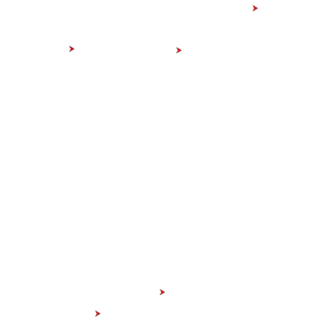

# Alignment
In the previous sections there was no interaction between the different boids. For the first time we will make our group of boids into a flock. We start to motivate them to align their heading.

Your brain function is called with two arguments. The first you are already familiar with. It is the boid for which we are determining the behavior.

The second argument is the flock. It maps a boid name to the corresponding name.

The flock allows us to iterate over each boid and process it. Because we are going to do these multiple times, once for each motivator, we are creating a function that will return the alignment. This way we can add other motivators by writing more functions.

So we start with the alignment function, which we will give the same interface as our brain function, so that we can easily combine things later.

```
begin alignment(boid, flock)

end
```

To align our our individual boid with the flock, we need to figure out the average heading. We do this by calculating the sum of all headings and dividing by the total number of boids in the flock.

```
total
for (_, b) in flock begin
    total += b.heading
end
total/flock.size
```

We will integrate the alignment directly into the brain of our boids. For this we will introduce a variable for the intended heading, equating it with the alignment of the flock.

```
heading = alignment(boid, flock)
{
    "heading": heading,
    "speed": 0.005
}
```

Since we have only one motivator at the moment, this will be our intended heading. Later we will worry over how to balance the different motivators.



