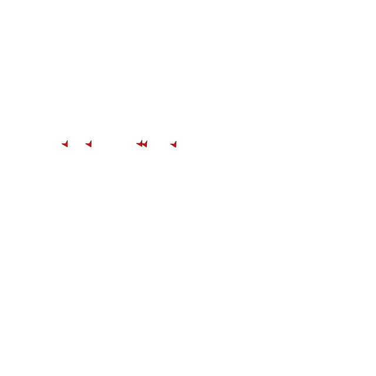

# Balance
With functions for the three basic motivators, i.e. alignment, cohesion and separation, under our belt, it is time to balance those motivations.

This is where you differentiate your flock from the rest. You will be picking weights for each motivations, mixing them into one and forming their characteristic behavior.

We begin by introducing three variables, one for each motivator heading. 

```
ha = alignment(boid, flock)
hc = cohesion(boid, flock)
hs = separation(boid, flock)
```

Next we will introduce three weights, and their total. This way we can easily mix the alignment until we dialed in to our intended behavior.

```
wa = 3
wc = 2
ws = 1
w = wa + wc + ws
```

Now the heading our boid will want to fly in is the weighted average of each motivators heading.

```
heading = (wa*ha + wc*hc + ws*hs)/w
```

This can be passed as the heading for our boid.

```
{
    "heading": heading,
    "speed": 0.005
}
```



## Experimentation
The weights for each motivator determine the behavior of each boid, and therefore of the entire flock. Try to find a balance that shows interesting behavior.