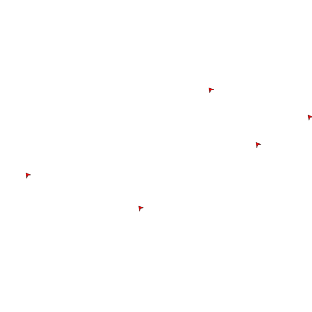

# Going in Circles
You have played around with the intended heading of your boids, and
noticed how they changed course. Let's try to make your boids go in
circles, by changing intended heading periodically.

So we want to change the heading of the boid slightly each time the
brain server is requested to provide an intent. We can use the boid
parameter that is passed to our function for that.

We first introduce a variable that we can easily change called `delta`
that will represent the amount of change in heading.
Next we will set the intended heading to the boids current heading 
with the sleight alteration.

```
delta := 1
{
    "heading": boid.heading + delta,
    "speed": 0.005
}
```



## Experimentation
Change the value of delta and see what happens. What do you notice?
Even with very large values of delta, the boids do not make tighter circles.

The reason for this is that the boids agility prevents them from instantly
changing heading. So ultimatly the are limited by how dexterous the boids are.