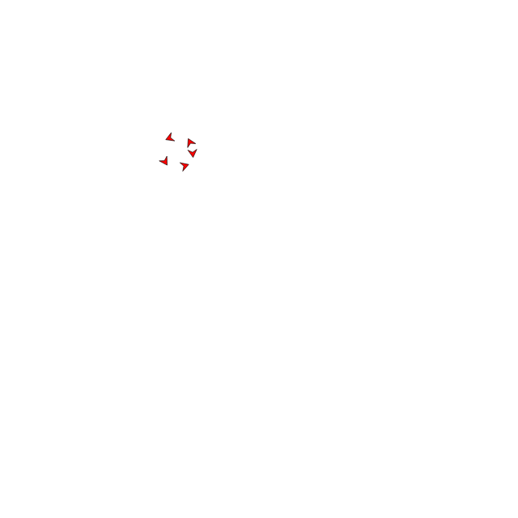

# Cohesion
The next motivator that we are considering is _cohesion_, i.e. the tendency to stick together.

We will create a function for this, just like we did for alignment. This allows us to easily switch things and combine them.

```
begin cohesion(boid, flock)

end
```

The intend of  a biod is to go to the center of the flock, so we better should find the center first. We do this by calculating the average x and y component.

```
x
y
for b in flock begin
    x += b.x
    y += b.y
end
x = x/flock.size
y = y/flock.size
```

This is the place we want to go. We now need to figure out which heading will bring us to that place. To go from where we are to where we want to go, we need to move `x - biod.x` along the x-axis and `y - boid.y` along the y axis.

To find the corresponding heading we need to use the [arctangent][] in the following way.

```
arctangent(y-boid.y, x-boid.x)
```

In order to only see the effect of cohesion, change the implementation of the brain to.

```
heading = cohesion(boid, flock)
{
    "heading": heading,
    "speed": 0.005
}
```



[arctangent]: https://en.wikipedia.org/wiki/Inverse_trigonometric_functions