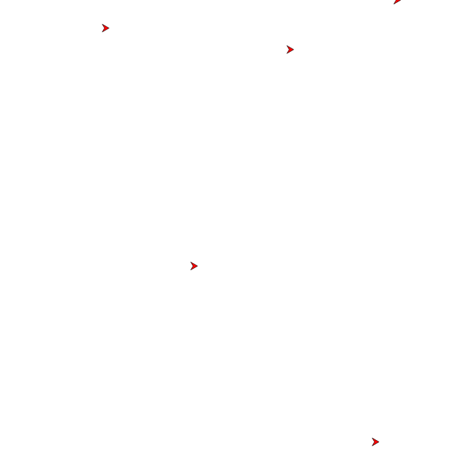

# First Flight
Orienting your boids is great and all. But boids are meant to fly!

We are going to make a tiny change to the intent of our boids. Instead
of staying in one spot, the intent should be to go, albeit slowly. A nice
speed to start out with is `0.005`. Adopt your intention accordingly

```json
{
    "heading": 0.0,
    "speed": 0.005,
}
```

Restart your brain server and see them go.



## Experimentation
Experiment with the speed and try different values. What do you experience?

Maybe you figured out that the speed of the boids is bounded. The boids are
capable of going faster than a certain limit.

The initial speed of `0.005`, or something close, works very well. So change
the speed value of your boids intent back to that value and let's head in an
other direction.