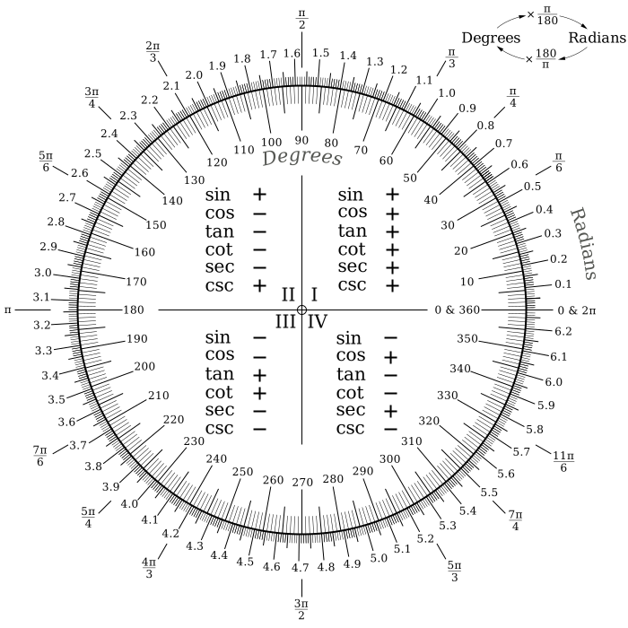
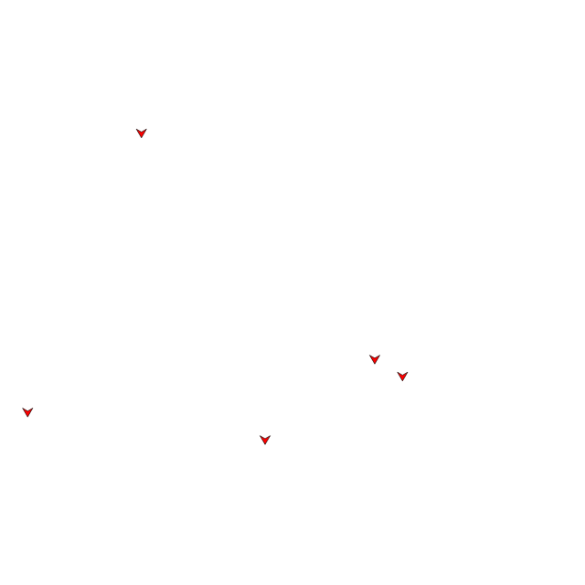

# Due North
Currently your boids are heading due east. Let's change direction and 
head due North.

For this you need to understand [_radians_][radians]. Radians is a way to measure angles.
Maybe you are more familiar with degrees. Radians are similar but have a different
scale. 



On the inside of this protractor there are _degrees_. On the outside are _radians_.
Take special note of the symbols around the outside. E.g. at 180 degrees we are also
at \\(\pi\\) radians.

Your boids use radians to signal their intended heading, but with a slightly different
convention. In stead of measuring angles from \\(0\\) to \\(2\pi\\), they are measured
from \\(-\pi\\) to \\(\pi\\). This does not differ for the upper halve of the protractor.

Take a look at the protractor and try to find 270 degrees. According to the protractor
this corresponds with \\(3\frac{\pi}{2}\\) radians. Our boids would call that
\\(-\frac{\pi}{2}\\).

## Intention
Let's make our boids head due north. Figure out what the number of radians corresponds
with heading due north. You could use the protractor, bribe the workshop leaders or
ask around.

Once you found the value, let's say it is `1.5707963267948966`, go ahead and change
the intended heading

```json
{
    "heading": 1.5707963267948966,
    "speed": 0.005
}
```

Your boids should change direction and head due north.



## Experimentation
Try different angles and see how your boids change their heading.

[radians]: https://en.wikipedia.org/wiki/Radian