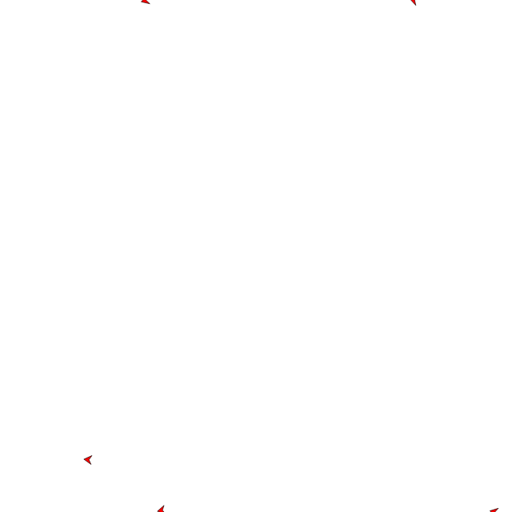

# Separation
The final basic motivator is _separation_, i.e. avoiding each other, for fear of bumping into each other.

With the experience gained by the other two motivators we will start by creating a separation function.

```
begin separation(boid, flock)

end
```

We would like to know each heading that would bring us towards a flock member, and then avoid these headings. For the first part we can determine a list of headings first. We do have to make sure that we do not determine the heading with ourselfs.

```
headings = []
for b in flock begin
    if b <> boid then begin
        h = arctangent(b.y - boid.y, b.x - boid.x)
        headings.push(h)
    end
end
```

With all these headings we would like to go the opposite way. One way of doing that is to calculate the average heading, and add a heading of \\(\pi\\).

```
heading
for h in headings begin
    heading += h
end
heading/headings.size + PI
```



## Experimentation
What other ways can you think of to avoid your flock mates?