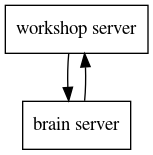

# Web Server
In this chapter we will describe the web server that you will be creating. If
you are using a starter kit, most of what is described here is already taken
care of.

## Communication
An important part of the workshop is the simulation of multiple flocks of boids.
This simulation is done by the _workshop server_. It keeps track of the different
teams participating in the workshop. Each team has it's own flock of boids that
they control.

Each team will run a server that will determine how their flock behaves. This is the
_brain server_.

The workshop server will periodically send every teams brain server a request. In this
request the brain server will find a representation of their flock. The response that 
the brain server will give it the intent of each boid. I.e. given this situation, what
would each of your boids in your flock do.

You can find more details in the following chapters.